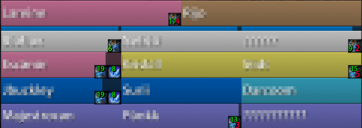

WoW Addons
==========

This is a list of addons written for World of Warcraft.
The addons are coded in LUA and rely on the WoW API.

These addons have not been maintained since Patch 8.2 (in the middle of the Battle for Azeroth extension) or even earlier, but hopefully, it should be easy to adapt the code to the current version of the WoW API.

License
-------

Copyright 2019-2022 Sebastian Muskalla

This project contains free and open-source software licensed under the MIT License, see [LICENSE](LICENSE)

Addons
------

### PitbullRaidResizer

PitbullRaidResizer interacts with the interface addon PitBull Unit Frames 4.0 (<https://www.curseforge.com/wow/addons/pitbull-unit-frames-4-0>).
PitBull Unit Frames is typically used to show your group layout in a grid with one cell per group members.

PitbullRaidResizer enables an aesthetically pleasing setup in which the group is displayed with one row for the tanks, one row for the healers, and multiple rows for the DPS players.
When players enter or leave the group (or change their role), PitbullRaidResizer dynamically resizes the cells so that each row has the same width in the interface.
PitbullRaidResizer can also adjust the number of columns and their height.
For example, consider a group consisting of 2 tanks, 5 healers, and 15 DPS players.
Assume the group interface is 500 pixels wide and consists of 5 rows. PitbullRaidResizer will adjust the width of each cell to 250px for tanks and 100px for every other player.

#### Examples

*2 tanks and 3 healers across one row each, 9 DPS players across 3 rows*

*2 tanks and 5 healers across one row each, 17 DPS players across 3 rows*

*2 tanks and 6 healers across one row each, 20 DPS players across 4 rows*

#### Configuration and testing

PitbullRaidResizer expects the groups `Raid Tanks`. `Raid Healer`, and `Raid DPS` to be set up in PitBull.
Each group should be configured to only show the players with the corresponding role.
The names of these groups and some other settings can be adjusted at the beginning of [PitbullRaidResizer.lua](PitbullRaidResizer/PitbullRaidResizer.lua).

Note that while the addon has been designed to show groups in the form of rows, the source code refers to these groups using `columns` because that is the internal designation used by PitBull.

PitbullRaidResizer provides two chat commands for testing:
* `/resizeinfo` will display the current group compilation and the resulting cell sizes.
* `/resizetest` will if you are currently not in a group simulate a certain number of tanks, healers, and DPS players. Use this in combination with PitBull's test mode to check that PitbullRaidResizer has been set up correctly.

### Broker_CombatTime

Broker_CombatTime is a broker plugin (using LBD - Lib Data Broker) whose output can be displayed using a suitable addon like Chocolate Bar (<https://www.curseforge.com/wow/addons/chocolatebar>).

It simply tracks the amount of time you have been in combat with your current enemy and is helpful to track events during boss fights.

Broker_CombatTime was written as a replacement for the deprecated addon CombatTime by oscarucb (<https://www.curseforge.com/wow/addons/combattime>).

No configuration needed!

### Broker_MovementSpeed

Broker_MovementSpeed is a broker plugin (using LBD - Lib Data Broker) whose output can be displayed using a suitable addon like Chocolate Bar (<https://www.curseforge.com/wow/addons/chocolatebar>).

It tracks your current movement speed, displayed as a percentage of your normal speed (i.e. walking without any buffs or debuffs).

Broker_CombatTime was written as a replacement for the deprecated addon Titan Vector (<https://www.curseforge.com/wow/addons/titan-vector>)

No configuration needed!

### Broker_RaidCount

 Broker_RaidCount is a broker plugin (using LBD - Lib Data Broker) whose output can be displayed using a suitable addon like Chocolate Bar (<https://www.curseforge.com/wow/addons/chocolatebar>).

It tracks the current group compilation, i.e. the number of members of the group and, if available, also the role distribution.
For example, if you are in a group with 28 members, 2 of which are tanks, 6 of which are healers, and the remaining 20 are DPS or have an unknown role, the addon will display the text `28 = 2 + 6 + 20`.

No configuration needed!
